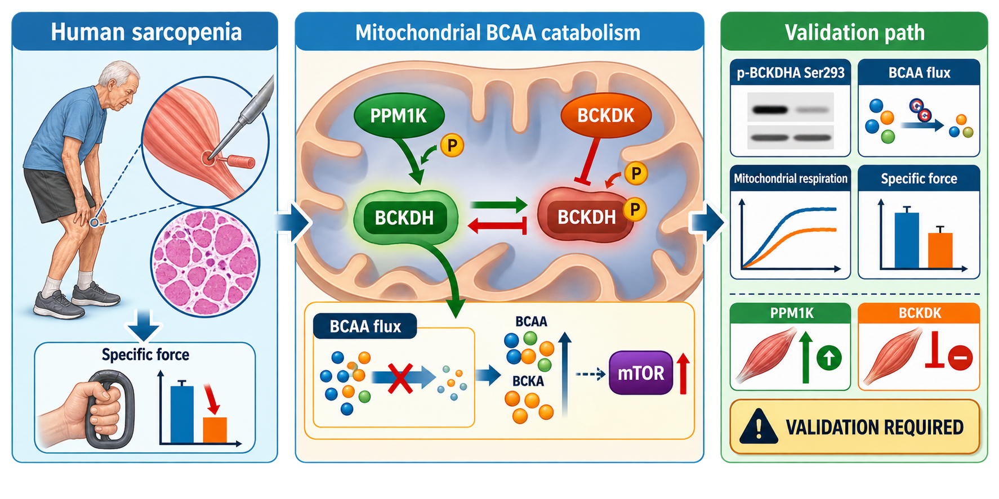
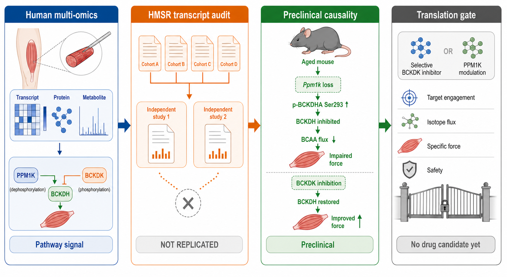

# The PPM1K–BCKDK–BCKDH axis in sarcopenia: convergent multi-omic and preclinical evidence with independent transcriptomic non-replication

**Article type:** Integrative translational analysis with secondary human transcriptomic target audit

**Version:** 1.0 (25 August 2026)

**Author:** Larry Oh

**Affiliation:** Brown Biotech, Seoul, South Korea

**Correspondence:** Larry Oh, Brown Biotech, Seoul, South Korea. Email: `ohbryt@gmail.com`

**Keywords:** sarcopenia; skeletal muscle; branched-chain amino acids; PPM1K; BCKDK; BCKDH; mitochondrial metabolism; target validation

## Abstract

Sarcopenia is defined clinically by loss of muscle strength and function, yet no molecularly targeted treatment has been established. Recent human multi-omic and mouse experiments nominate defective branched-chain amino-acid (BCAA) disposal as a potentially causal metabolic lesion. The committed BCAA-catabolic enzyme complex BCKDH is inhibited by BCKDK-mediated phosphorylation of BCKDHA at Ser293 and activated by PPM1K-mediated dephosphorylation, making the PPM1K–BCKDK–BCKDH node experimentally and pharmacologically tractable. We combined a targeted synthesis of primary mechanistic studies with an independent secondary audit of four human skeletal-muscle case-control subsets in the Human skeletal Muscle Sarcopenia Resource. The audit included 135 strict binary samples from two independent source groups. None of the individual axis transcripts replicated after random-effects meta-analysis: PPM1K, BCKDK, BCKDHA, and BCKDHB all had genome-wide false-discovery rates above 0.91, with mixed source-group directions and substantial heterogeneity for three genes. These null transcript results do not negate a post-translational flux defect, because BCKDH activity is governed directly by phosphorylation and nutrient state. Published human multi-omics and aged and *Ppm1k*-deficient mouse experiments support pathway-level causality, whereas studies of BT2 reveal mitochondrial uncoupling and BCKDK-independent tryptophan displacement. We therefore nominate the axis as a prioritized human target-validation programme, not as a validated target or drug candidate. Advancement should require disease-endotype selection, p-BCKDHA Ser293 target engagement, isotope-resolved BCAA flux, genetic reproduction of pharmacology, and rescue of specific muscle force without mitochondrial or systemic metabolic toxicity.

**Graphical abstract.** Human sarcopenia multi-omics motivates a PPM1K–BCKDK–BCKDH activity hypothesis. PPM1K activates BCKDH through dephosphorylation, whereas BCKDK inhibits the complex through phosphorylation. The therapeutic hypothesis remains gated by human target engagement, isotope-resolved BCAA flux, mitochondrial function, specific force, and safety.

## Introduction

Sarcopenia is a progressive skeletal-muscle disorder in which loss of strength and physical performance is more clinically consequential than reduced muscle mass alone [1]. The gap between mass and function has important consequences for therapeutic discovery. A molecular intervention should not advance merely because it enlarges muscle or changes a circulating biomarker; it should improve the capacity of innervated muscle to generate and recover force. Mitochondrial substrate oxidation is central to that capacity, particularly during repeated contraction when ATP demand, calcium recovery, redox control, and proteostasis must increase together.

Branched-chain amino acids have a dual biological role that complicates target selection. Leucine, isoleucine, and valine provide substrates and anabolic signals, but their carbon skeletons must also be disposed of through mitochondrial metabolism. After transamination, branched-chain α-ketoacids enter the BCKDH complex, which catalyses the committed irreversible step of BCAA oxidation. BCKDK phosphorylates BCKDHA at Ser293 and inhibits the complex, whereas the mitochondrial phosphatase PPM1K removes this phosphate and activates BCKDH [2,3]. The biologically relevant variable is therefore not the abundance of one transcript in isolation but the integrated balance of BCKDK and PPM1K activity, BCKDH phosphorylation, substrate availability, and downstream oxidative flux.

Zuo and colleagues recently reported that BCAA-catabolic disruption was prominent across human sarcopenia multi-omics and replication analyses. Their mouse experiments further showed that defective BCAA catabolism impaired mass and strength through dysregulated mTOR signalling, whereas BT2-mediated enhancement of BCAA catabolism protected aged mice and mice lacking *Ppm1k* [2]. This package is unusually strong for a sarcopenia mechanism because it combines human tissue observations with genetic and pharmacological experiments. It nevertheless leaves two translational uncertainties. First, the generalizability of the individual regulatory transcripts across independent human muscle cohorts has not been established. Second, BT2 has pharmacology outside BCKDK inhibition that may confound both efficacy and safety [4–6].

We addressed these uncertainties by performing a deterministic target audit within HMSR and by grading the primary evidence at four levels: human association, independent replication, causal perturbation, and pharmacological specificity. Our objective was not to declare a drug candidate. It was to determine whether the PPM1K–BCKDK–BCKDH axis is sufficiently supported to replace MARCHF5 as the principal target-validation programme and to define the experiments required for a defensible therapeutic nomination.

## Methods

### Evidence synthesis

We conducted a targeted, non-systematic synthesis of primary studies available through 25 August 2026. Searches focused on human sarcopenia multi-omics, PPM1K or BCKDK control of BCKDH, BCKDH phosphorylation and BCAA flux in skeletal muscle, genetic or pharmacological causal experiments, and the selectivity liabilities of BCKDK inhibitors. Reviews and commentaries were used only to identify primary records. For each study, we extracted the experimental system, intervention or exposure, endpoint, principal result, and major limitation. Because this was a targeted translational synthesis rather than a systematic review, no PRISMA completeness claim is made.

### Human transcriptomic target audit

The secondary analysis used four strict human skeletal-muscle case-control subsets assembled in HMSR: GSE111006, GSE111010, and GSE111016 from the GSE111017 study family, plus the independent GSE226151 study. The strict analysis contained 135 samples, comprising 53 sarcopenia cases and 82 controls. The three GSE111017 subsets were treated as one source group when judging independent replication. Pre-sarcopenia and other non-binary phenotypes were excluded.

Within each cohort, normalized expression was modelled by ordinary least squares with sarcopenia status and estimable age and sex covariates. Cohort effects were combined with DerSimonian–Laird random-effects meta-analysis, and Benjamini–Hochberg correction was applied genome-wide. The deterministic target extractor filtered the frozen cohort and replication matrices for PPM1K, BCKDK, BCKDHA, and BCKDHB, retained exact source rows, recorded input SHA-256 hashes, counted independent source groups, and assigned `NOT_REPLICATED` unless the meta-analysis passed genome-wide FDR below 0.05 and showed the same direction in at least two independent source groups. All target-level values reported below derive from `results/target_audits/*_claims.json` and the associated TSV files.

### Evidence interpretation

Evidence was weighted by directness and experimental control. Human multi-omic associations were treated as disease-relevance evidence but not causality. Cross-cohort transcript replication was treated as a test of steady-state RNA generalizability, not of enzyme activity. Genetic perturbation with muscle functional outcomes was treated as causal preclinical evidence. Small-molecule results were considered target-specific only when supported by target engagement or genetic dependence and when plausible off-target effects were excluded. A pathway could be prioritized for validation despite a transcript null, but it could not be called a validated human drug target without activity-level human replication and functional causality.

## Results

### Published evidence supports a BCAA-catabolic mechanism

The primary human multi-omic study identified disrupted BCAA catabolism across discovery and replication cohorts and linked this state to BCAA accumulation and reduced muscle health [2]. In aged and *Ppm1k*-deficient mice, impaired catabolism was accompanied by loss of muscle mass and strength and dysregulated mTOR signalling, whereas BT2 treatment improved the reported sarcopenic phenotypes [2]. These experiments support the causal importance of restoring BCAA disposal in those models. They do not, by themselves, establish that PPM1K abundance, BCKDK abundance, or any single component is the dominant lesion in every person with sarcopenia.

Independent metabolic work supports the architecture of the regulatory node. Manipulating BCKDK or PPM1K changes BCKDH phosphorylation and BCAA/BCKA metabolism in vivo, although much of the foundational work concerns liver, heart, obesity, or cardiometabolic disease rather than sarcopenia [3,7]. More recent experiments in mouse and human skeletal myotubes showed that nutrient context can increase BCKDHA Ser293 phosphorylation and suppress isotope-traced leucine carbon entry into downstream tricarboxylic-acid-cycle-associated metabolites through a PPM1K-dependent mechanism [8]. The axis is therefore dynamically regulated at the protein and flux levels.

### Individual axis transcripts do not replicate across HMSR

The independent HMSR audit did not validate a consistent case-control transcript signal for any of the four prespecified axis genes (Table 1). PPM1K showed an essentially null random-effects estimate, mixed direction within the GSE111017 family, and no leave-one-cohort-out replication. BCKDK also failed genome-wide correction, although its heterogeneity estimate was zero and its leave-one-cohort-out directional replication rate was 0.75. BCKDHA was detected in only three cohorts and showed high heterogeneity, while BCKDHB showed very high heterogeneity. All four machine-readable audits returned `NOT_REPLICATED`.

**Table 1. HMSR transcript audit of the PPM1K–BCKDK–BCKDH axis.**

| Gene | Cohorts | Strict n | Meta beta | SE | Meta p | Genome-wide FDR | I² (%) | LOCO rate | Status |
|---|---:|---:|---:|---:|---:|---:|---:|---:|---|
| *PPM1K* | 4 | 135 | -0.00582 | 0.15436 | 0.96993 | 0.99741 | 57.78 | 0.00 | NOT_REPLICATED |
| *BCKDK* | 4 | 135 | -0.05719 | 0.05258 | 0.27671 | 0.91583 | 0.00 | 0.75 | NOT_REPLICATED |
| *BCKDHA* | 3 | 112 | -0.02228 | 0.07494 | 0.76627 | 0.97383 | 80.92 | 0.00 | NOT_REPLICATED |
| *BCKDHB* | 4 | 135 | -0.10069 | 0.23545 | 0.66890 | 0.95456 | 92.38 | 0.50 | NOT_REPLICATED |

The negative audit constrains the target claim in two ways. It excludes a simple model in which a reproducible change in one axis transcript defines human sarcopenia across cohorts. It also prevents use of transcript direction to choose between PPM1K augmentation and BCKDK inhibition. Notably, the non-significant BCKDK estimate points downward in the meta-analysis, which is not the direction expected under a universal “excess BCKDK transcript” hypothesis. Any therapeutic direction must therefore be selected by phosphorylation, flux, and functional response rather than by RNA abundance.

### Post-translational regulation reconciles pathway evidence with transcript nulls

The human transcript null and the published multi-omic pathway signal are not mutually exclusive. BCKDH is switched acutely by phosphorylation, and the kinase–phosphatase balance can change activity without a corresponding change in transcript abundance. Nutrient perturbation in human skeletal myotubes changes p-BCKDHA Ser293 and isotope-resolved leucine flux in a PPM1K-dependent context [8]. The most direct human target-engagement biomarker is consequently the p-BCKDHA Ser293-to-total BCKDHA ratio, interpreted alongside BCAA/BCKA abundance and labelled carbon flux. Steady-state PPM1K and BCKDK RNA should remain contextual measurements rather than release criteria.

### BT2 validates the mechanism but not the molecule

BT2 is useful as a proof-of-mechanism reagent because it inhibits BCKDK and can increase BCAA disposal. It is not an acceptable lead benchmark without stringent counterscreens. Independent studies show that BT2 increases proton conductance and mitochondrial proton leak, including effects independent of BCKDK inhibition [4,5]. A final peer-reviewed study also showed that BT2 lowered plasma tryptophan and increased kynurenine-pathway disposal in wild-type and *Bckdk*-null mice by displacing albumin-bound tryptophan [6]. These effects can alter mitochondrial and systemic physiology independently of the proposed sarcopenia mechanism.

The broader BCKDK chemistry literature demonstrates tractability but also shows that nominal enzyme inhibition is insufficient. The thiophene inhibitor PF-07208254 produced sustained BCAA/BCKA lowering and reduced BDK protein in mouse cardiometabolic models, whereas related thiazoles increased BDK abundance and lost chronic metabolic efficacy despite binding the target [7]. Scaffold-dependent effects on BCKDK stability, complex proximity, exposure, and off-target mitochondrial chemistry must therefore be incorporated into the target product profile.

**Figure 1. Evidence ladder for the PPM1K–BCKDK–BCKDH axis.** Published human multi-omics supports pathway-level BCAA-catabolic disruption, whereas the independent HMSR audit does not replicate the individual transcripts. Mouse genetics and pharmacology provide causal preclinical support, but human target engagement, flux, force, and safety remain closed translation gates.

**Table 2. Evidence grade and translational interpretation.**

| Evidence layer | Principal observation | Confidence | Translation boundary |
|---|---|---|---|
| Human sarcopenia multi-omics | BCAA-catabolic disruption across discovery and replication analyses [2] | Moderate to high for pathway association | Observational tissue data do not identify a universal regulatory lesion |
| HMSR human transcript audit | Four axis genes fail independent transcript replication | High for the reported RNA null | Does not test phosphorylation or metabolic flux |
| Aged and *Ppm1k*-deficient mice | Defective catabolism impairs mass and strength; BT2 is protective [2] | High within reported mouse models | No human intervention or chronic human safety evidence |
| Human myotube nutrient perturbation | p-BCKDHA and labelled leucine flux are PPM1K-sensitive [8] | Moderate mechanistic support | Not performed in clinically defined sarcopenic donor muscle |
| BCKDK pharmacology | BCKDK is chemically tractable, with scaffold-dependent efficacy [7] | High for tractability | Cardiometabolic models are not sarcopenia efficacy models |
| BT2 selectivity | Mitochondrial uncoupling and tryptophan displacement are documented [4–6] | High for liabilities | BT2 should not be treated as the translational candidate |

## Discussion

This synthesis supports prioritizing the PPM1K–BCKDK–BCKDH axis over MARCHF5 for sarcopenia target validation, but it does not support claiming that the axis is already a validated human target. The distinction is central. MARCHF5 lacked replicated human association and causal skeletal-muscle evidence. The BCAA-catabolic axis has direct human multi-omic disease relevance and genetic and pharmacological causality in mouse models. Its independent transcript audit is nevertheless negative. The resulting evidence package is stronger at the pathway and activity levels than at the individual-gene-expression level.

The most defensible therapeutic hypothesis is selective restoration of BCKDH flux in a biomarker-defined sarcopenic endotype. Eligible human muscle should show elevated p-BCKDHA Ser293, impaired labelled BCAA or BCKA oxidation, and reduced energetic or contractile reserve despite adequate substrate availability. This definition avoids conflating insufficient dietary BCAA with defective intracellular disposal. Such caution is necessary because a cross-sectional analysis of 108,017 UK participants associated higher circulating BCAAs with greater muscle mass and strength, and higher valine with lower sarcopenia odds [9]. Circulating concentration, dietary provision, intramuscular accumulation, and mitochondrial oxidative flux are not interchangeable variables.

PPM1K augmentation and BCKDK inhibition represent two ways to shift the same regulatory switch, but their development paths differ. BCKDK has established allosteric chemistry and measurable target engagement, making selective inhibition the more conventional small-molecule route. PPM1K may offer a physiologically direct means of dephosphorylating BCKDH, but selective phosphatase activation is generally less mature and requires careful substrate-wide profiling. The programme should therefore evaluate both directions genetically before committing to chemistry. PPM1K overexpression or CRISPR activation and BCKDK knockdown should be compared head-to-head in the same primary human muscle system, with rescue by wild-type constructs and loss of effect under mechanism-breaking controls.

The primary human experiment should use engineered muscle derived from independently recruited older sarcopenic donors, older non-sarcopenic donors, and young controls. Treatment effects should be analysed at the donor level. The intervention should be tested under a defined contractile and BCAA challenge, and advancement should require a coherent chain from reduced p-BCKDHA Ser293 through increased isotope-resolved BCAA oxidation to improved mitochondrial recovery and post-fatigue specific force. Muscle size, steady-state RNA, or BCAA concentration alone should not qualify as success. Direct comparisons should include genetic PPM1K augmentation, genetic BCKDK suppression, BT2 as a mechanistic but liability-bearing reference, and at least one chemically distinct BCKDK inhibitor.

Safety and selectivity must be integral rather than deferred. The assay package should measure proton leak, membrane potential, respiratory reserve, viability, autophagic flux, mTOR dynamics, insulin signalling, albumin displacement, and tryptophan–kynurenine metabolites. A compound that lowers BCAA but uncouples mitochondria or perturbs tryptophan handling fails the translational gate even if force transiently improves. Chemistry should be advanced only after direct BCKDK engagement, p-BCKDHA response, genetic dependence, durable exposure-response, and separation from BT2-like weak-acid uncoupling.

This study has important limitations. The HMSR audit contains four sample sets but only two independent source groups, and its bulk RNA measurements cannot resolve cell type, protein abundance, phosphorylation, or metabolic flux. The external causal sarcopenia package is concentrated in one recent multi-omic and mouse study, and no controlled human intervention has shown that modulating this axis improves strength or physical performance. The evidence synthesis was targeted rather than systematic. Finally, neither BT2 nor another BCKDK inhibitor has been validated here as a sarcopenia drug candidate. These limitations prevent a clinical efficacy claim but define a tractable experimental sequence.

## Conclusion

The PPM1K–BCKDK–BCKDH axis is the strongest current mechanistic target-validation programme emerging from this sarcopenia evidence package, but it is not a newly validated drug target and BT2 is not a drug candidate. Published human multi-omics and mouse causality justify focused investment, while the HMSR transcript null requires an activity-first strategy. The decisive next evidence must connect p-BCKDHA Ser293, isotope-resolved BCAA flux, genetic target dependence, mitochondrial competence, and donor-level specific-force rescue in human sarcopenic muscle. Until that chain is demonstrated with selective chemistry and safety, the programme should remain in target validation.

## Data and code availability

The HMSR repository is available at `https://github.com/ohbryt/mitochondria_sarcopenia`. Structured modality and dataset audits are provided in `results/modality_detected.csv` and `results/dataset_audit.csv`. Exact target rows, machine-readable claims, and input hashes are provided in `results/target_audits/`. The deterministic extractor is `scripts/extract_target_evidence.py`. The full source matrices are regenerable from the public GEO cohorts and are not committed because of size.

## Ethics statement

This study reanalysed de-identified public datasets and published aggregate evidence. No new human participants or animals were enrolled.

## Competing interests

The author is affiliated with Brown Biotech and declares no other competing interests.

## Funding

This work was supported by Brown Biotech internal funding. No external funding was received.

## Generative-AI disclosure

OpenAI tools assisted with language editing and the two conceptual schematics. The author reviewed the biological directionality and all scientific claims. The schematics contain no primary data and should be checked against the target journal's image policy before submission.

## References

1. Cruz-Jentoft AJ, Sayer AA. Sarcopenia. *Lancet*. 2019;393:2636–2646. doi: [10.1016/S0140-6736(19)31138-9](https://doi.org/10.1016/S0140-6736(19)31138-9).
2. Zuo X, Zhao R, Wu M, et al. Multi-omic profiling of sarcopenia identifies disrupted branched-chain amino acid catabolism as a causal mechanism and therapeutic target. *Nature Aging*. 2025;5:419–436. doi: [10.1038/s43587-024-00797-8](https://doi.org/10.1038/s43587-024-00797-8).
3. White PJ, McGarrah RW, Grimsrud PA, et al. The BCKDH kinase and phosphatase integrate BCAA and lipid metabolism via regulation of ATP-citrate lyase. *Cell Metabolism*. 2018;27:1281–1293.e7. doi: [10.1016/j.cmet.2018.04.015](https://doi.org/10.1016/j.cmet.2018.04.015).
4. Rivera CN, Smith CE, Draper LV, et al. The BCKDH kinase inhibitor BT2 promotes BCAA disposal and mitochondrial proton leak in both insulin-sensitive and insulin-resistant C2C12 myotubes. *Journal of Cellular Biochemistry*. 2024;125:e30520. doi: [10.1002/jcb.30520](https://doi.org/10.1002/jcb.30520).
5. Acevedo A, Jones AE, Danna BT, et al. The BCKDK inhibitor BT2 is a chemical uncoupler that lowers mitochondrial ROS production and de novo lipogenesis. *Journal of Biological Chemistry*. 2024;300:105702. doi: [10.1016/j.jbc.2024.105702](https://doi.org/10.1016/j.jbc.2024.105702).
6. Bowman CE, Neinast MD, Kawakami R, et al. Off-target depletion of plasma tryptophan by allosteric inhibitors of BCKDK. *Molecular Metabolism*. 2025;97:102165. doi: [10.1016/j.molmet.2025.102165](https://doi.org/10.1016/j.molmet.2025.102165).
7. Roth Flach RJ, Bollinger E, Reyes AR, et al. Small molecule branched-chain ketoacid dehydrogenase kinase inhibitors with opposing effects on BDK protein levels. *Nature Communications*. 2023;14:4812. doi: [10.1038/s41467-023-40536-y](https://doi.org/10.1038/s41467-023-40536-y).
8. Sumi K, Shioyama M, Munakata K, Takasugi S, Morifuji M, Nakamura K. Lauric acid engages an O-GlcNAc-sensitive BCKDH regulatory node to modulate branched-chain amino acid oxidation in skeletal myotubes. *Journal of Biological Chemistry*. 2026;302:113345. doi: [10.1016/j.jbc.2026.113345](https://doi.org/10.1016/j.jbc.2026.113345).
9. Liu H, Zhang Q, Hao Q, et al. Associations between sarcopenia and circulating branched-chain amino acids: a cross-sectional study over 100,000 participants. *BMC Geriatrics*. 2024;24:541. doi: [10.1186/s12877-024-05144-5](https://doi.org/10.1186/s12877-024-05144-5).
